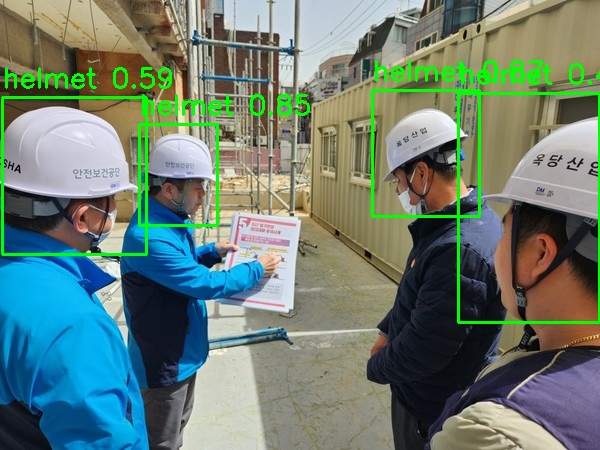

<h1> YOLOv8 과 Django를 활용한 안전모 착용 감지 시스템 구현 </h1>
 
<h2> 프로젝트 개요 </h2>
이 프로젝트는 Roboflow.com에서 다운로드한 데이터셋을 이용하여, Google Colab에서 YOLOv8 모델을 학습시킨 후, Python의 Django 프레임워크를 활용해 사진을 통해 착용 여부를 탐지하는 웹 애플리케이션을 구현한 것입니다.
  

<h2> 프로젝트 기간 : 25.04.14 ~ 25.04.24 ( 11일 ) </h2>
<h2> 기대효과  </h2>
1. 산업현장의 안전 강화: 작업자의 안전모 착용 여부를 감지하여 사고 예방에 기여  
2. 효율적인 인력 운용: 수작업으로 진행되던 안전 점검을 자동화하여 관리자의 업무 부담 경감  

<h2>* 결과 이미지 : </h2>

